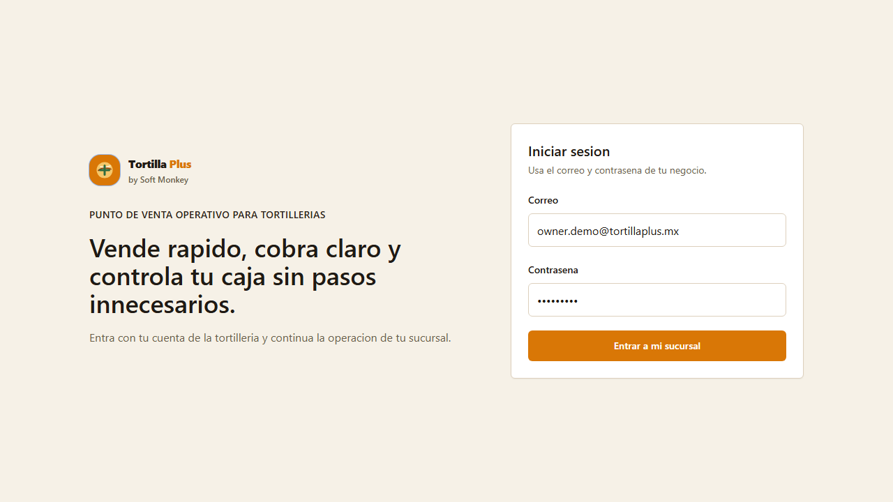
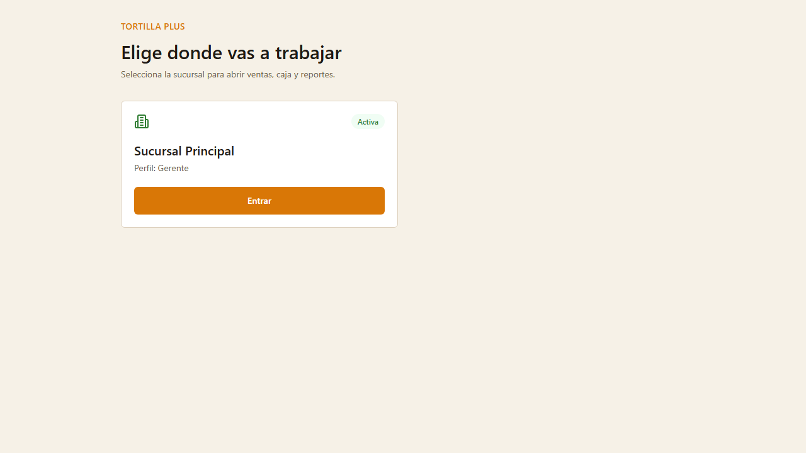
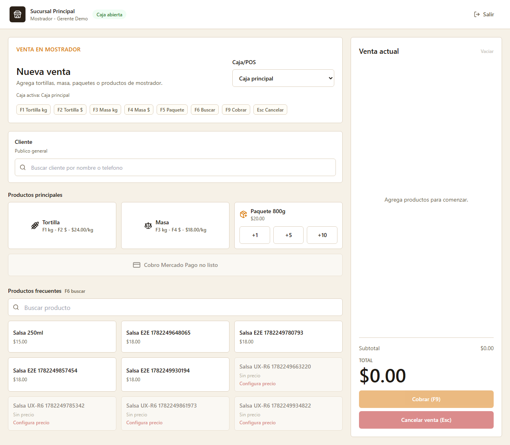
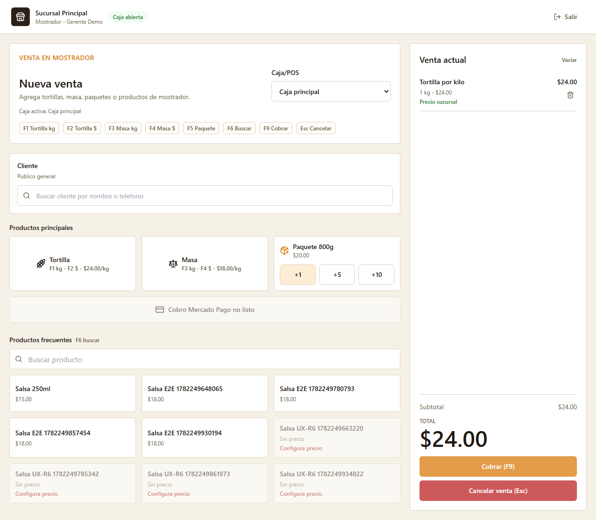
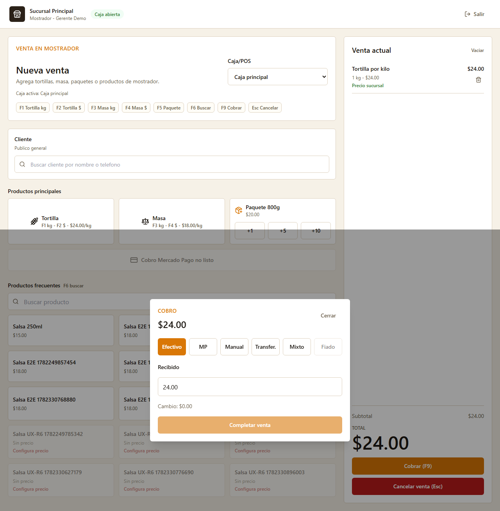
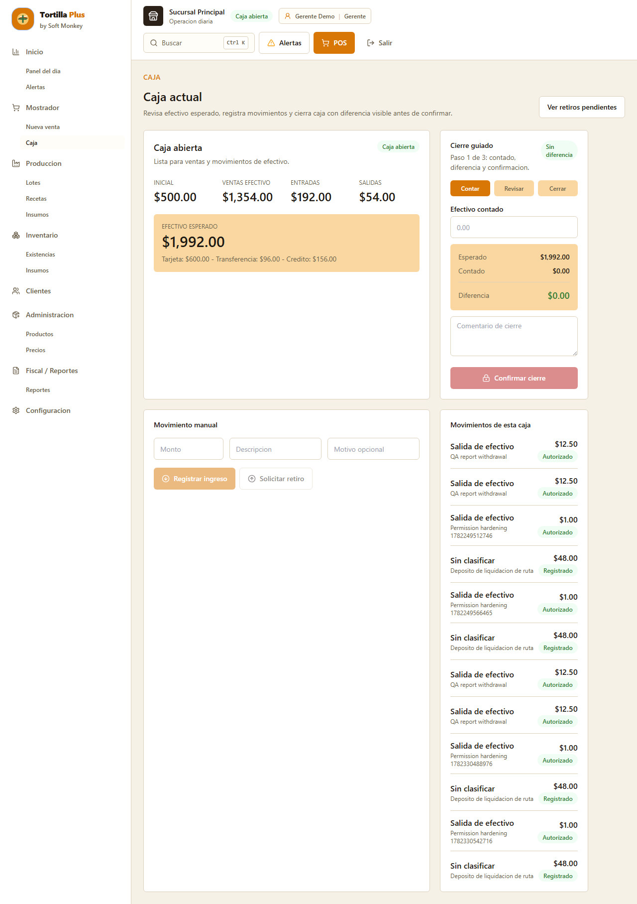
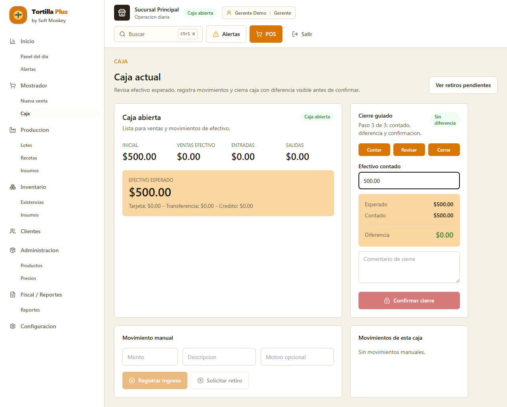

# Tortilla Plus - Manual del cajero V0.1

**Rol:** Cajero  
**Estado:** Base para piloto  
**Fuente de screenshots:** `docs/manuals/screenshots/`  

---

## Portada

# Manual del cajero

Guia de usuario final para piloto controlado.

Este manual cubre:

```txt
- acceso al sistema
- seleccion de sucursal
- POS
- atajos de teclado
- ticket
- cobro
- caja
- cierre de caja
- errores comunes
```

---

## 1. Objetivo del rol

El cajero opera ventas de mostrador, cobra tickets y mantiene la caja diaria controlada durante su turno.

Su objetivo operativo es vender rapido, capturar correctamente y cerrar caja sin diferencias no justificadas.

---

## 2. Que puede hacer

- Iniciar sesion y trabajar en la sucursal asignada.
- Abrir POS y registrar ventas de mostrador.
- Agregar productos vendibles al ticket.
- Cobrar en efectivo, tarjeta, transferencia o credito cuando el cliente aplica.
- Consultar el ticket antes de completar la venta.
- Abrir caja si el flujo lo solicita.
- Revisar caja actual y participar en el cierre guiado cuando tenga permiso.

---

## 3. Que no puede hacer

- No administra productos, precios, recetas ni usuarios.
- No configura reglas de credito.
- No opera como repartidor autenticado.
- No emite promesas de bascula real ni busqueda global funcional.
- No resuelve alertas backend formales; las alertas visibles son operativas y derivadas del frontend.

---

## 4. Flujo general del cajero

```txt
1. Entrar al sistema.
2. Confirmar sucursal.
3. Entrar a POS.
4. Agregar producto al ticket.
5. Revisar cantidad, precio y total.
6. Abrir cobro.
7. Capturar metodo de pago.
8. Completar venta.
9. Revisar caja.
10. Cerrar caja si corresponde.
```

---

## 5. Acceso al sistema

El cajero inicia sesion con su correo y contrasena.



### Pasos

1. Abrir la URL del sistema.
2. Capturar correo.
3. Capturar contrasena.
4. Presionar **Entrar a mi sucursal**.

---

## 6. Seleccion de sucursal

Si el usuario tiene mas de una sucursal, debe elegir donde va a trabajar.



### Importante

Todas las ventas, caja e inventario quedan asociados a la sucursal activa.

Si se eligio la sucursal incorrecta, avisar al gerente antes de vender.

---

## 7. Pantalla POS

La pantalla POS es el centro de operacion del cajero.



### Elementos principales

- Productos principales: tortilla, masa y paquete.
- Productos de mostrador.
- Busqueda.
- Ticket actual.
- Boton de cobro.
- Estado de caja/POS.

---

## 8. Atajos de teclado

Los atajos aceleran la captura.

| Tecla | Accion |
|---|---|
| F1 | Tortilla por kg |
| F2 | Tortilla por monto |
| F3 | Masa por kg |
| F4 | Masa por monto |
| F5 | Paquete |
| F6 | Buscar |
| F9 | Cobrar |
| Esc | Cancelar / cerrar modal |

Estos atajos no dependen de bascula real. La bascula queda fuera del piloto.

---

## 9. Agregar productos al ticket

Cada producto agregado debe revisarse antes de cobrar.



### Pasos

1. Seleccionar producto o usar atajo.
2. Capturar cantidad, kilos o monto.
3. Agregar al ticket.
4. Revisar precio unitario y total.

---

## 10. Cobrar venta

El cobro debe abrirse solo cuando el ticket esta correcto.



### Reglas

- No completar venta con pago incompleto.
- Usar credito solo si el cliente aplica.
- Confirmar cambio antes de entregar efectivo.
- Cancelar cobro si el cliente cambia de metodo de pago.

---

## 11. Caja actual

La caja muestra el estado del turno.



Si no hay caja abierta, el POS puede bloquear la venta.

---

## 12. Cierre de caja

El cierre compara efectivo esperado contra efectivo contado.



### Pasos

1. Contar efectivo fisico.
2. Capturar efectivo contado.
3. Revisar diferencia calculada.
4. Capturar comentario si hay diferencia.
5. Cerrar caja solo si la informacion es correcta.

---

## 13. Errores comunes

| Caso | Que hacer |
|---|---|
| No hay caja abierta | Abrir caja desde el flujo de POS o avisar al gerente. |
| Producto no aparece en POS | Confirmar con gerente que sea vendible y tenga precio. |
| Pago incompleto | Revisar que el monto cubra el total del ticket. |
| Cliente sin credito disponible | Usar otro metodo de pago o pedir autorizacion operativa. |
| Se capturo cantidad incorrecta | Corregir el item antes de cobrar o cancelar el ticket. |

---

## 14. Checklist final del turno

- La caja fue abierta en la sucursal correcta.
- No quedan tickets pendientes por cobrar.
- Las ventas fueron completadas correctamente.
- Los pagos coinciden con el total de los tickets.
- El efectivo fisico fue contado.
- Las diferencias tienen comentario operativo.
- El gerente fue informado de cualquier error o bloqueo.

---

## 15. Fuera de alcance del piloto

No prometer al usuario piloto:

```txt
- bascula real
- busqueda global funcional
- alertas backend formales
- repartidor autenticado
- contador como rol final
```
